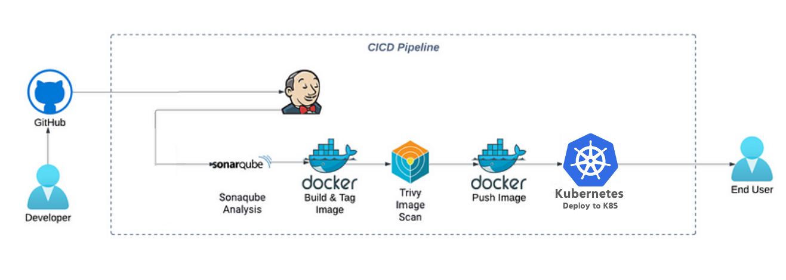

# Flask Project

This project is a Flask application designed to demonstrate a Continuous Integration and Continuous Deployment (CI/CD) pipeline architecture. The architecture automates the process of building, testing, and deploying applications efficiently.

## Overview

The CI/CD pipeline integrates various tools and processes to automate the software delivery lifecycle. This architecture aims to ensure that code changes are consistently tested and deployed to production with high quality.

## Stages of the Pipeline

1. **GitHub**:
   - Source code is managed in GitHub, where developers commit their changes.

2. **SonarQube**:
   - Code quality and security analysis is performed using SonarQube to ensure best practices and detect vulnerabilities.

3. **Docker Build & Tag Image**:
   - The application is packaged into a Docker image. This image is tagged for easy identification.

4. **Trivy Image Scan**:
   - A security scan of the Docker image is performed using Trivy to identify any vulnerabilities.

5. **Docker Push Image**:
   - The scanned Docker image is pushed to a Docker registry for storage and future deployment.

6. **Kubernetes**:
   - The final step involves deploying the application to a Kubernetes cluster, making it available to end users.

## Benefits of CI/CD

- **Faster Delivery**: Automated processes reduce the time between code commit and deployment.
- **Improved Quality**: Continuous testing and quality checks ensure that only high-quality code is deployed.
- **Enhanced Security**: Regular scans for vulnerabilities enhance the security of the application.
- **Collaboration**: Teams can work together more effectively with streamlined processes.

## Conclusion

This Flask Project demonstrates a robust CI/CD pipeline architecture that facilitates efficient software development and delivery. By leveraging automation and industry best practices, the project ensures that applications are built, tested, and deployed reliably.
